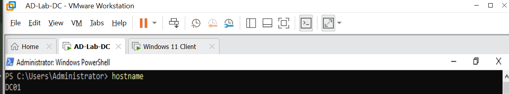
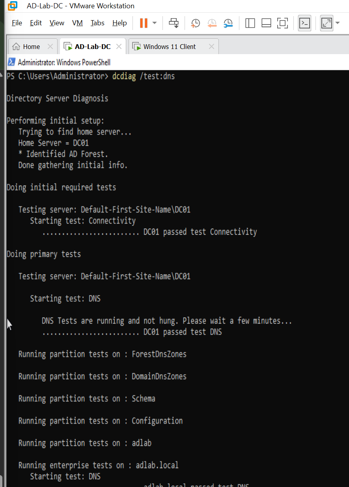
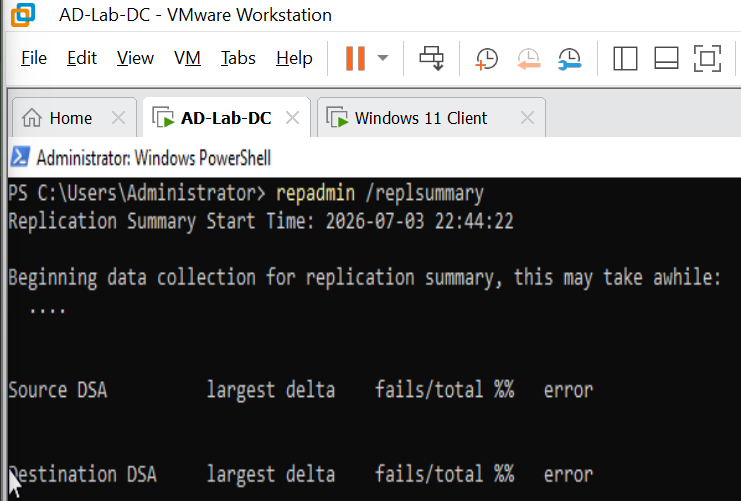
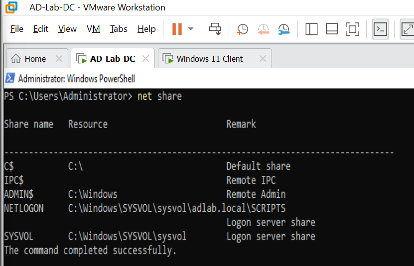
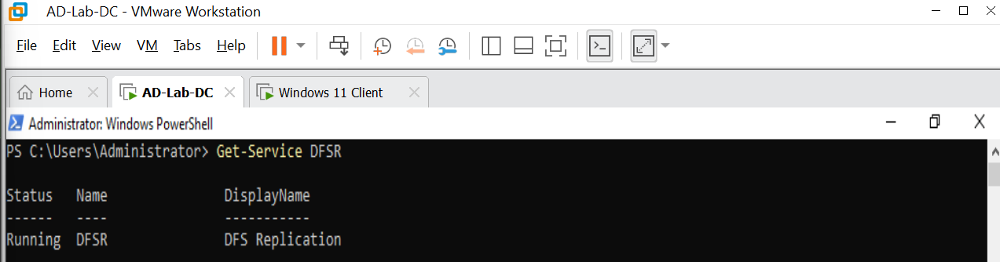
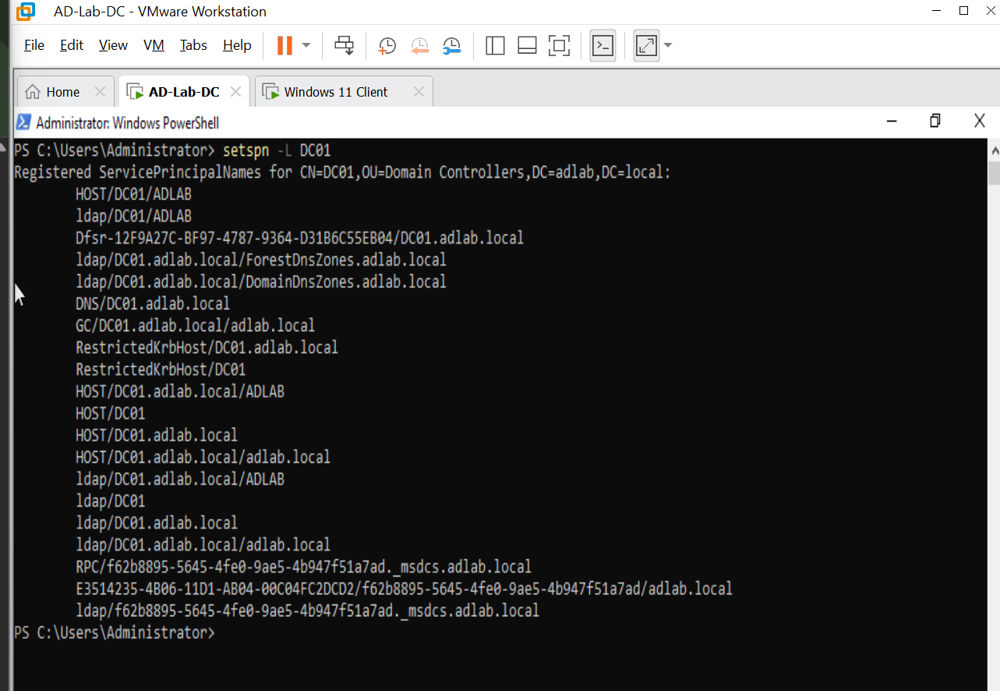
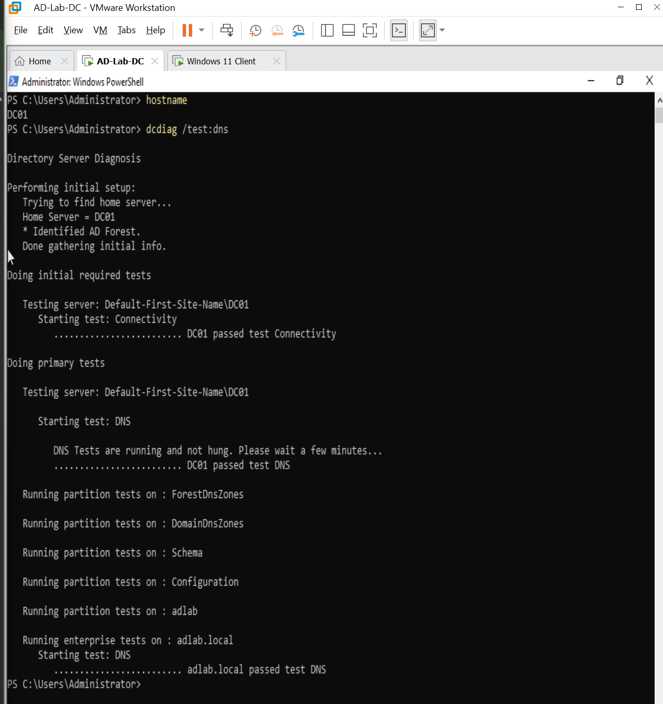
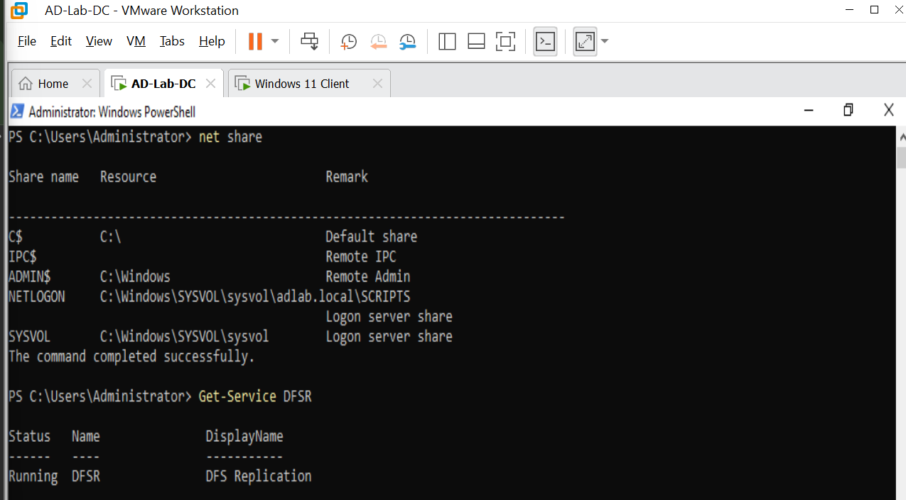

# Domain Controller Validation

## Objective

Validate the health of the Active Directory Domain Controller after renaming the server to DC01.

---

## Validation Steps Performed

- Verified hostname and computer name.
- Verified Service Principal Names (SPNs).
- Verified DNS health using `dcdiag /test:dns`.
- Verified SYSVOL and NETLOGON shares.
- Verified DFS Replication service status.
- Verified Active Directory replication health.

---

## 1. Verify Domain Controller Hostname

The server hostname and computer name were verified after renaming the Domain Controller to **DC01**.

```powershell
hostname
```



---

## 2. Verify DNS Health

DNS health was validated using the Active Directory Domain Controller diagnostic utility.

```powershell
dcdiag /test:dns
```



---

## 3. Verify Active Directory Replication Health

Active Directory replication health was checked using `repadmin`.

```powershell
repadmin /replsummary
```



---

## 4. Verify SYSVOL and NETLOGON Shares

The Domain Controller shares were verified to confirm that **SYSVOL** and **NETLOGON** were available.

```powershell
net share
```



---

## 5. Verify DFS Replication Service

The DFS Replication service was checked to confirm that it was running.

```powershell
Get-Service DFSR
```



---

## 6. Verify Service Principal Names

Service Principal Names (SPNs) registered to DC01 were verified.

```powershell
setspn -L DC01
```



---

## 7. Final Domain Controller Health Check

Additional Domain Controller health checks were performed to confirm that Active Directory services remained healthy after the server rename.





---

## Commands Used

```powershell
hostname

setspn -L DC01

ipconfig /all

dcdiag /test:dns

repadmin /replsummary

net share

Get-Service DFSR
```

---

## Results

- Domain Controller renamed successfully to DC01.
- DNS tests passed.
- SYSVOL and NETLOGON shares available.
- DFS Replication service running.
- Replication health clean.
- Historical DFSR warnings observed after rename but no active issues detected.

---

## Lessons Learned

Even after renaming a Domain Controller, Active Directory can remain healthy provided DNS registration, SYSVOL, and replication services are functioning correctly.