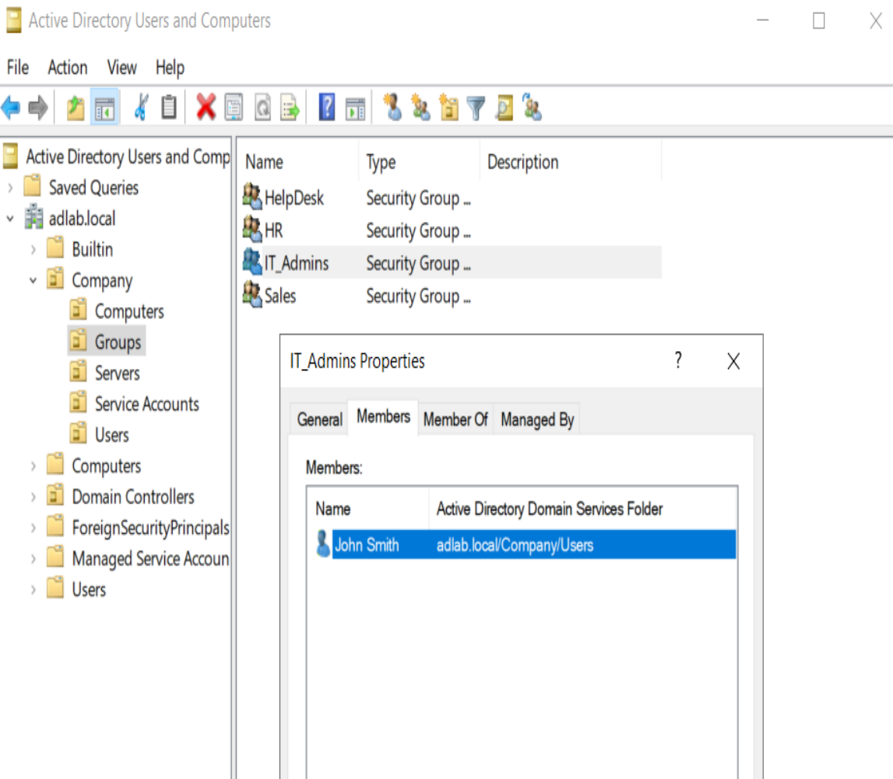

# Help Desk Administration Tasks

This document outlines common Active Directory administration tasks performed by Help Desk and Junior Systems Administrators.

---

# Create a User Account

## Using Active Directory Users and Computers (GUI)

1. Open **Active Directory Users and Computers** (`dsa.msc`).
2. Navigate to:

```text
Company
└── Users
```

3. Right-click the **Users** OU.
4. Select:

```text
New → User
```

5. Enter:

- First Name
- Last Name
- User Logon Name

6. Set a temporary password.
7. Select:

- User must change password at next logon (optional)
- Password never expires (lab only)

8. Click **Finish**.

### Verify Active Directory User Accounts

The created user accounts were verified within Active Directory Users and Computers to confirm that they were successfully created in the appropriate Organizational Unit.


---

## Using PowerShell

```powershell
New-ADUser `
-Name "John Smith" `
-GivenName "John" `
-Surname "Smith" `
-SamAccountName jsmith `
-UserPrincipalName jsmith@adlab.local `
-Path "OU=Users,OU=Company,DC=adlab,DC=local" `
-AccountPassword (ConvertTo-SecureString "Password123!" -AsPlainText -Force) `
-Enabled $true
```

---

# Reset a User Password

## GUI Method

1. Open **Active Directory Users and Computers**.
2. Locate the user account.
3. Right-click the user.
4. Select:

```text
Reset Password
```

5. Enter the new password.
6. Select:

```text
User must change password at next logon
```

7. Click **OK**.

---

## PowerShell Method

```powershell
Set-ADAccountPassword `
-Identity jsmith `
-NewPassword (ConvertTo-SecureString "Password123!" -AsPlainText -Force)
```

---

# Disable a User Account

## GUI Method

1. Locate the user account.
2. Right-click the user.
3. Select:

```text
Disable Account
```

---

## PowerShell Method

```powershell
Disable-ADAccount -Identity jsmith
```

---

# Enable a User Account

## GUI Method

1. Locate the disabled user.
2. Right-click the account.
3. Select:

```text
Enable Account
```

---

## PowerShell Method

```powershell
Enable-ADAccount -Identity jsmith
```

---

# Unlock a User Account

## GUI Method

1. Open user properties.
2. Select:

```text
Account
```

3. Check:

```text
Unlock account
```

4. Click **Apply**.

---

## PowerShell Method

```powershell
Unlock-ADAccount -Identity jsmith
```

---

# Add User to a Security Group

## GUI Method

1. Open user properties.
2. Select:

```text
Member Of
```

3. Click:

```text
Add
```

4. Enter the group name.
5. Click **Check Names**.
6. Click **OK**.

### Verify Security Group Configuration

Security groups were configured within Active Directory to support role-based and departmental access management.


### Verify IT Administrators Group Membership

The user's security group membership was verified to confirm assignment to the **IT_Admins** group.



---

## PowerShell Method

```powershell
Add-ADGroupMember `
-Identity "IT_Admins" `
-Members jsmith
```

---

# Remove User from a Security Group

## GUI Method

1. Open user properties.
2. Select:

```text
Member Of
```

3. Highlight the group.
4. Click:

```text
Remove
```

---

## PowerShell Method

```powershell
Remove-ADGroupMember `
-Identity "IT_Admins" `
-Members jsmith
```

---

# Verify User Group Membership

```powershell
Get-ADPrincipalGroupMembership jsmith |
Select Name
```

---

# Verify User Information

```powershell
Get-ADUser jsmith -Properties * |
Select Name,Enabled,LockedOut
```

---

# Verify Domain User Authentication

After configuring the Active Directory user account and permissions, domain authentication was verified from the Windows 11 client workstation.


---

# Skills Demonstrated

- Active Directory Administration
- User Account Management
- Password Resets
- Account Lockout Administration
- Security Group Management
- PowerShell Administration
- Help Desk Troubleshooting
- Identity and Access Management (IAM)

---

# Resume Relevance

The tasks documented in this guide reflect common responsibilities performed by:

- IT Support Technician
- Help Desk Analyst
- Service Desk Technician
- Junior Systems Administrator
- Desktop Support Technician