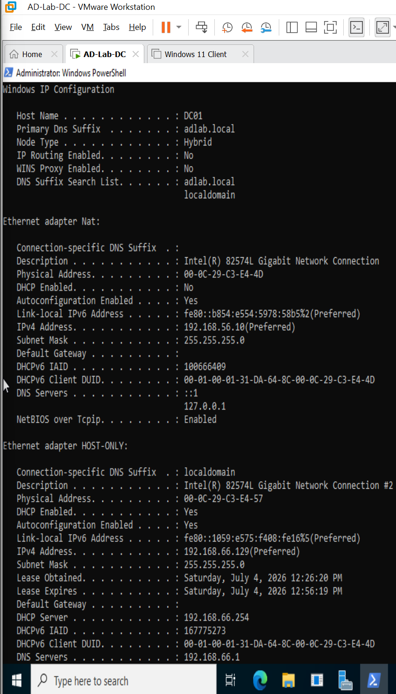
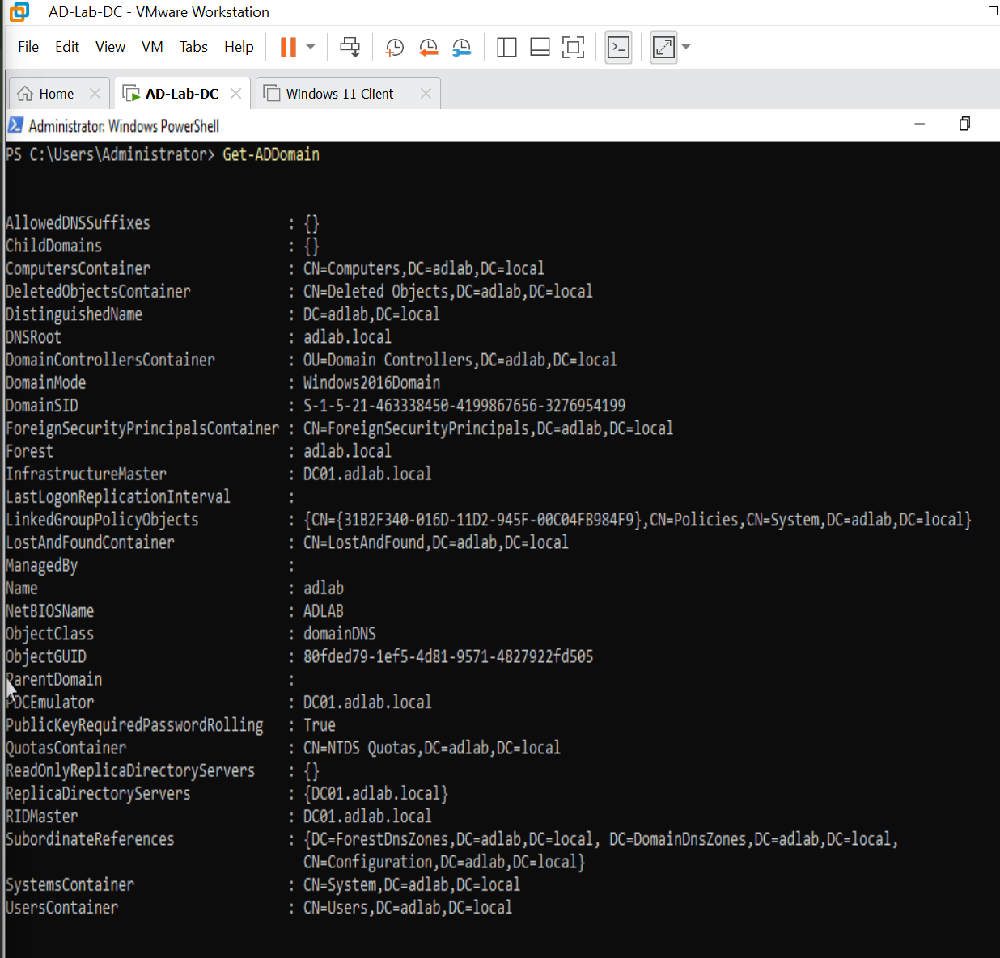
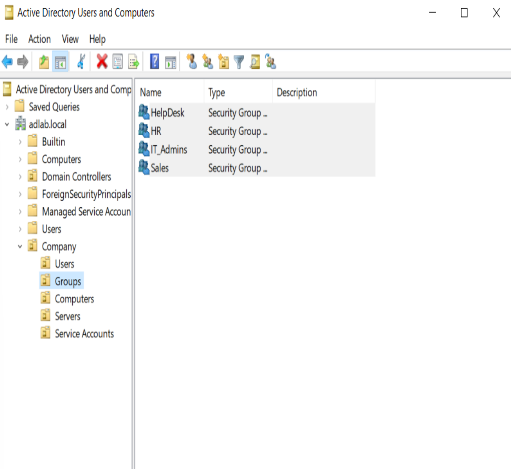

# Installation Notes

This document outlines the initial deployment and configuration of the Active Directory Home Lab environment.

---

# Environment Information

| Item | Value |
|------|--------|
| Hypervisor | VMware Workstation Pro |
| Domain Controller | DC01 |
| Client Workstation | CLIENT01 |
| Domain Name | adlab.local |
| Forest Functional Level | Windows Server 2022 |
| Domain Functional Level | Windows Server 2022 |

---

# Server Configuration

## Server Name

```text
DC01
```

---

## Host-Only Network Configuration

### Domain Controller (DC01)

| Setting | Value |
|----------|--------|
| IP Address | 192.168.66.10 |
| Subnet Mask | 255.255.255.0 |
| Default Gateway | None |
| Preferred DNS Server | 192.168.66.10 |

### DC01 Network Configuration Verification

The Domain Controller was configured with a static IPv4 address and configured to use itself as the preferred DNS server.



---

### Client Workstation (CLIENT01)

| Setting | Value |
|----------|--------|
| IP Address | 192.168.66.20 |
| Subnet Mask | 255.255.255.0 |
| Default Gateway | None |
| Preferred DNS Server | 192.168.66.10 |

---

# Installed Server Roles

The following Windows Server roles were installed:

- Active Directory Domain Services (AD DS)
- DNS Server

---

# Active Directory Deployment

## Domain Information

```text
Domain Name: adlab.local
NetBIOS Name: ADLAB
```

---

## Domain Controller Promotion

The server was promoted to a Domain Controller using:

```text
Add a new forest
```

with the following configuration:

| Setting | Value |
|----------|--------|
| Domain Name | adlab.local |
| Forest Functional Level | Windows Server 2022 |
| Domain Functional Level | Windows Server 2022 |
| DNS Server | Installed |
| Global Catalog | Enabled |

### Domain Configuration Verification

The Active Directory domain configuration was verified after DC01 was successfully promoted to a Domain Controller.



---

# Organizational Structure Created

```text
adlab.local
└── Company
    ├── Users
    ├── Groups
    ├── Computers
    ├── Servers
    └── Service Accounts
```

### Organizational Unit Structure

The Organizational Unit structure was created to logically organize Active Directory objects and provide a foundation for administration, delegation, and future Group Policy deployment.


---

# Security Groups Created

```text
IT_Admins
HelpDesk
HR
Sales
```

### Security Group Configuration

Security groups were created to support departmental organization and group-based access control within the Active Directory environment.



---

# Test Users Created

| Name | Username | Department |
|------|-----------|------------|
| John Smith | jsmith | IT |
| Sarah Brown | sbrown | Help Desk |
| Emily Davis | edavis | HR |
| Mike Wilson | mwilson | Sales |

### Active Directory User Accounts

Test user accounts were created to represent users across multiple departments within the simulated organization.


---

# Validation and Health Checks

The following validation steps were completed:

## Verify IP Configuration

```cmd
ipconfig /all
```

---

## Verify Domain Controller Health

```cmd
dcdiag /v
```

---

## Verify DNS Resolution

```cmd
nslookup adlab.local
```

---

## Verify Active Directory Services

```powershell
Get-Service NTDS,DNS,Netlogon,KDC
```

---

## Verify Domain Information

```powershell
Get-ADDomain
```

---

## Verify Forest Information

```powershell
Get-ADForest
```

---

# Client Domain Join Validation

The following tests were completed successfully:

- CLIENT01 joined to adlab.local
- DNS resolution verified
- Domain authentication verified
- CLIENT01 visible in Active Directory Users and Computers
- Successful login using domain credentials

### Verify CLIENT01 Domain Membership

CLIENT01 was successfully joined to the `adlab.local` Active Directory domain.


### Verify Domain Authentication

Successful domain authentication was confirmed by signing into CLIENT01 using Active Directory domain credentials.


---

# Screenshots Collected

- DC01-IPConfig.png
- DC01-DomainInfo.png
- DC01-DCDiag-01.png
- DC01-DCDiag-02.png
- DC01-DCDiag-03.png
- DC01-DCDiag-04.png
- OU-Structure.png
- Security-Groups.png
- AD-Users.png
- CLIENT01-Domain-Joined.png
- Client-Domain-Login.png
- Client-System-Properties.png

---

# Lessons Learned

- DNS is critical to Active Directory functionality.
- Static IP addressing should be configured before promoting a Domain Controller.
- Proper virtual network configuration is essential for domain communication.
- Documentation and screenshots significantly simplify troubleshooting and future administration.
- PowerShell provides a powerful method for administering Active Directory.

---

# Final Status

The Active Directory environment has been successfully deployed and validated. This environment will serve as the baseline for future projects involving:

- Help Desk Administration
- Group Policy Management
- PowerShell Automation
- File Server Administration