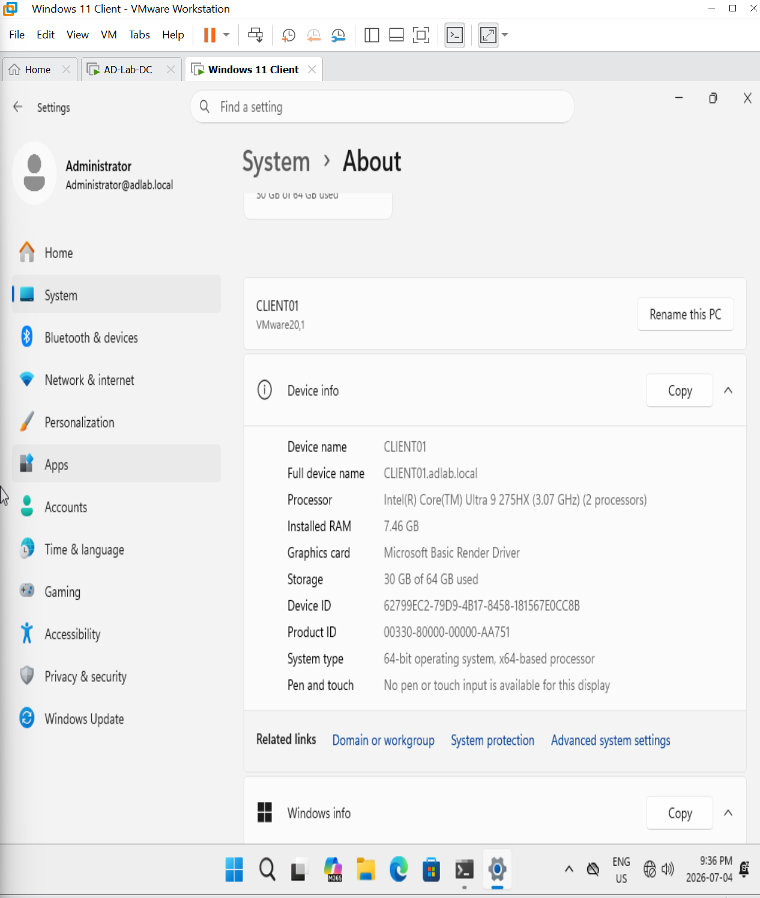

# Active Directory Lab Setup Guide

## Overview

This project demonstrates the deployment and administration of a Windows Server Active Directory environment using Windows Server 2022 and Windows 11 in a virtualized lab.

The objective of this lab is to simulate an enterprise Active Directory environment and develop practical system administration and troubleshooting skills.

---

# Objectives

- Install Windows Server 2022
- Configure a Domain Controller
- Install Active Directory Domain Services (AD DS)
- Configure DNS
- Create Organizational Units (OUs)
- Create Domain Users and Security Groups
- Deploy a Windows 11 client
- Join the client to the domain
- Validate Active Directory and DNS functionality
- Document the deployment and troubleshooting process

---

# Lab Environment

## Virtualization Platform

- VMware Workstation Pro
- VirtualBox (optional)

---

# Virtual Machines

## Domain Controller (DC01)

| Setting | Value |
|---------|--------|
| Name | DC01 |
| Operating System | Windows Server 2022 |
| RAM | 4 GB |
| CPU | 2 vCPUs |
| Disk | 60 GB |
| Role | Domain Controller / DNS Server |

---

## Client Workstation (CLIENT01)

| Setting | Value |
|---------|--------|
| Name | CLIENT01 |
| Operating System | Windows 11 |
| RAM | 4 GB |
| CPU | 2 vCPUs |
| Disk | 60 GB |
| Role | Domain-Joined Workstation |

---

# Network Configuration

## Host-Only Network (VMnet1)

| Device | IP Address | DNS |
|---------|------------|-----|
| DC01 | 192.168.66.10 | 192.168.66.10 |
| CLIENT01 | 192.168.66.20 | 192.168.66.10 |

Subnet Mask:

```text
255.255.255.0
```

---

# Domain Information

| Setting | Value |
|----------|--------|
| Domain Name | adlab.local |
| NetBIOS Name | ADLAB |
| Forest Functional Level | Windows Server 2022 |
| Domain Functional Level | Windows Server 2022 |

---

# Server Configuration Steps

## Step 1 – Install Windows Server 2022

- Create virtual machine.
- Install Windows Server 2022.
- Set Administrator password.
- Install VMware Tools.

---

## Step 2 – Rename Server

Rename the server:

```text
DC01
```

PowerShell:

```powershell
Rename-Computer -NewName "DC01" -Restart
```

---

## Step 3 – Configure Static IP Address

Configure:

| Setting | Value |
|----------|--------|
| IP Address | 192.168.66.10 |
| Subnet Mask | 255.255.255.0 |
| Preferred DNS | 192.168.66.10 |

### DC01 Network Configuration

The Domain Controller was configured with a static IPv4 address and configured to use itself as the preferred DNS server.


---

## Step 4 – Install Active Directory Domain Services

Server Manager:

```text
Manage
→ Add Roles and Features
→ Active Directory Domain Services
→ DNS Server
```

---

## Step 5 – Promote Server to Domain Controller

Configuration:

```text
Add a new forest
```

Domain:

```text
adlab.local
```

### Domain Controller Information

The completed Active Directory domain configuration was verified after DC01 was promoted to a Domain Controller.


---

# Active Directory Structure

```text
adlab.local
└── Company
    ├── Users
    ├── Groups
    ├── Computers
    ├── Servers
    └── Service Accounts
```

### Organizational Unit Structure

The Active Directory Organizational Unit structure was created to logically organize users, groups, computers, servers, and service accounts.


---

# Security Groups Created

```text
IT_Admins
HelpDesk
HR
Sales
```

### Active Directory Security Groups

Security groups were created to support role-based access and departmental administration within the lab environment.


---

# Test Users Created

| Name | Username | Department |
|------|-----------|------------|
| John Smith | jsmith | IT |
| Sarah Brown | sbrown | Help Desk |
| Emily Davis | edavis | HR |
| Mike Wilson | mwilson | Sales |

### Active Directory User Accounts

Test user accounts were created and organized within Active Directory to simulate users from multiple departments.


---

# Windows 11 Client Deployment

## Configure Static Network

| Setting | Value |
|----------|--------|
| IP Address | 192.168.66.20 |
| Subnet Mask | 255.255.255.0 |
| Preferred DNS | 192.168.66.10 |

---

## Rename Client

```powershell
Rename-Computer -NewName "CLIENT01" -Restart
```

---

## Join Client to Domain

```powershell
Add-Computer -DomainName adlab.local -Credential adlab\Administrator -Restart
```

### CLIENT01 Domain Membership

The Windows 11 client was successfully joined to the `adlab.local` Active Directory domain.


### Verify Client System Properties

Windows System Properties were used to verify the workstation name and Active Directory domain membership.



### Verify Domain User Authentication

Domain authentication was tested from CLIENT01 using an Active Directory user account.


---

# Validation Steps

## Verify Network Configuration

```cmd
ipconfig /all
```

---

## Verify DNS Resolution

```cmd
nslookup adlab.local
```

---

## Verify Connectivity

```cmd
ping 192.168.66.10
```

---

## Verify Domain Controller Health

```cmd
dcdiag /v
```

---

## Verify Domain Information

```powershell
Get-ADDomain
```

---

## Verify Forest Information

```powershell
Get-ADForest
```

---

# Screenshots Captured

- DC01-IPConfig.png
- DC01-DomainInfo.png
- DC01-DCDiag-01.png
- DC01-DCDiag-02.png
- DC01-DCDiag-03.png
- DC01-DCDiag-04.png
- OU-Structure.png
- Security-Groups.png
- AD-Users.png
- CLIENT01-Domain-Joined.png
- Client-Domain-Login.png
- Client-System-Properties.png

---

# Skills Demonstrated

- Windows Server Administration
- Active Directory Administration
- DNS Configuration
- Virtual Networking
- User and Group Administration
- Domain Joining
- PowerShell Administration
- Troubleshooting
- Documentation and Version Control

---

# Final Status

This lab successfully demonstrates the deployment of a fully functional Active Directory environment from initial server installation through domain client integration.

This environment will serve as the baseline for future repositories covering:

- IT Help Desk Administration
- Group Policy Management
- PowerShell Automation
- File Server Administration