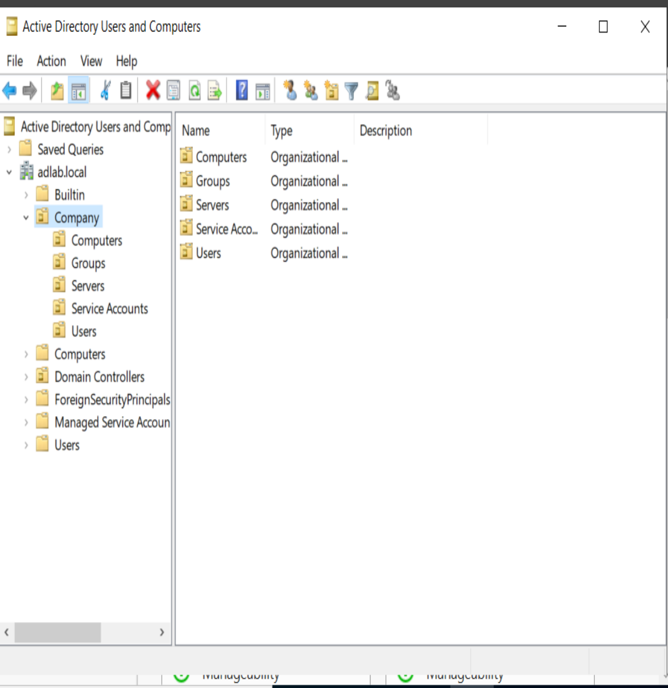
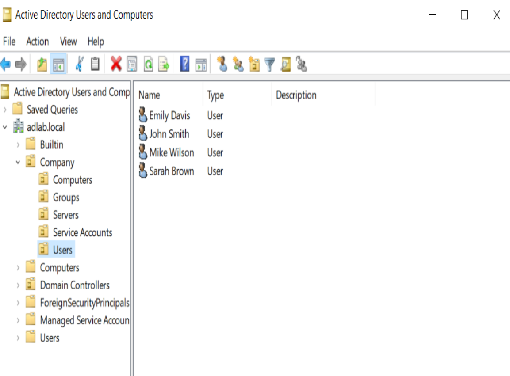
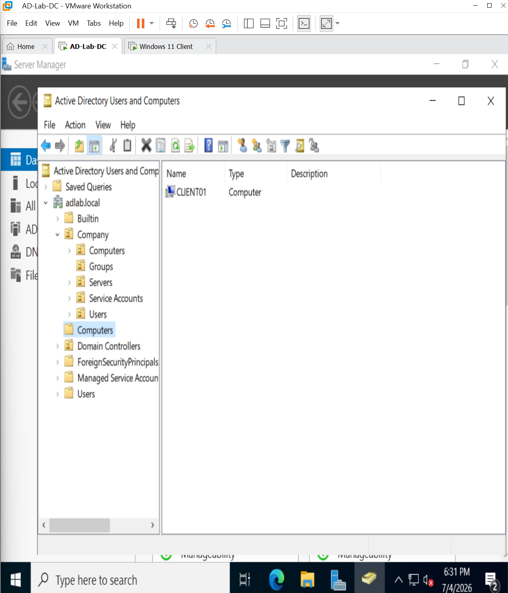
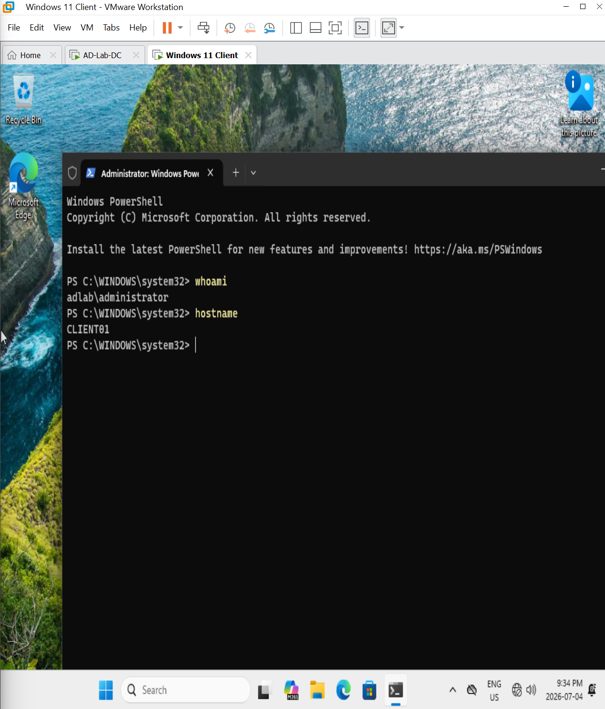

# Active Directory Home Lab


---

## Overview

This project demonstrates the deployment and administration of a Windows Server Active Directory environment in a virtual lab. The purpose of this project is to develop hands-on experience with common help desk and system administration tasks typically performed in enterprise environments.

---

## Current Project Status

- ✅ Domain Controller deployed
- ✅ Active Directory and DNS configured
- ✅ Domain Controller health validated (DCDIAG)
- ✅ Organizational Units created
- ✅ Security Groups created
- ✅ Test Users created
- ✅ Windows 11 client joined to domain
- ✅ Domain authentication verified
- ✅ Active Directory deployment complete
- 🚧 Future administration tasks moved to separate repositories

---

## Latest Milestone

### Milestone 4 – Domain Join Complete

- Configured Windows 11 client networking
- Joined CLIENT01 to `adlab.local`
- Verified DNS resolution
- Verified domain authentication
- Added screenshots and documentation

---

## Objectives

- Deploy a Windows Server Domain Controller
- Configure Active Directory Domain Services (AD DS)
- Create and manage Organizational Units (OUs)
- Create and manage users and security groups
- Join a Windows client to a domain
- Perform common help desk administration tasks
- Document the environment and troubleshooting process

---

## Lab Environment

### Virtualization Platform

- VMware Workstation Pro
- VirtualBox (optional migration platform)

### Servers and Clients

| Device | Operating System | Purpose |
|---------|------------------|----------|
| DC01 | Windows Server 2022 | Domain Controller |
| CLIENT01 | Windows 11 | Domain Joined Workstation |

---

## Domain Information

**Domain Name:** `adlab.local`

---

## Network Configuration

### DC01

- Static IP Address: `192.168.66.10`
- Subnet Mask: `255.255.255.0`
- Preferred DNS Server: `192.168.66.10`

### CLIENT01

- Static IP Address: `192.168.66.20`
- Subnet Mask: `255.255.255.0`
- Preferred DNS Server: `192.168.66.10`

---

## Architecture Diagram


**Figure 1:** High-level network topology of the Active Directory home lab environment.

### Network Overview

- DC01 – Windows Server 2022 Domain Controller and DNS Server
- CLIENT01 – Windows 11 Domain-Joined Workstation
- VMnet1 Host-Only Network – Internal lab communication
- Domain: `adlab.local`

---

## Technologies Used

- Windows Server 2022
- Active Directory Domain Services (AD DS)
- DNS
- Windows 11
- PowerShell
- VMware Workstation Pro
- VirtualBox
- Git
- GitHub

---

## Skills Demonstrated

- Active Directory installation and configuration
- Domain Controller deployment
- Organizational Unit (OU) management
- User account administration
- Security group administration
- DNS configuration and troubleshooting
- Windows Server administration
- Domain controller health validation
- PowerShell administration and automation
- Documentation and version control using Git and GitHub

---

## Active Directory Structure

```text
adlab.local
└── Company
    ├── Users
    ├── Groups
    ├── Computers
    ├── Servers
    └── Service Accounts
```

### Organizational Unit Structure

The Active Directory environment uses a structured Organizational Unit design to logically organize users, groups, computers, servers, and service accounts.



### Security Groups

```text
IT_Admins
HelpDesk
HR
Sales
```

### Test Users

| Name | Username | Group |
|------|-----------|--------|
| John Smith | jsmith | IT_Admins |
| Sarah Brown | sbrown | HelpDesk |
| Emily Davis | edavis | HR |
| Mike Wilson | mwilson | Sales |

### Active Directory User Administration

Test user accounts were created and organized within Active Directory to simulate users across multiple departments.



---

## Help Desk Tasks Completed

- Installed and configured Active Directory Domain Services
- Promoted server to Domain Controller
- Configured DNS
- Created Organizational Units (OUs)
- Created domain users
- Created security groups
- Added users to security groups
- Joined a Windows client to the domain
- Verified domain authentication
- Verified domain controller health using DCDIAG
- Documented configuration and screenshots
- Used PowerShell to automate administrative tasks

---

## Domain Client Integration

### CLIENT01 Successfully Joined to Domain

CLIENT01 was successfully joined to the `adlab.local` Active Directory domain.



### Domain Authentication Verified

Domain authentication was successfully verified from the Windows 11 client using an Active Directory user account.



---

## Documentation

Detailed implementation, administration, troubleshooting, and validation documentation can be found in the `Documentation` folder.

### Project Documentation

- [Lab Setup Guide](Documentation/Lab-Setup-Guide.md)
- [Installation Notes](Documentation/Installation-Notes.md)
- [Help Desk Administration Tasks](Documentation/Helpdesk-Tasks.md)
- [Troubleshooting Notes](Documentation/Troubleshooting-Notes.md)
- [Domain Controller Validation](Documentation/Domain-Controller-Validation.md)
- [Project Summary](Documentation/Project-Summary.md)

The documentation includes configuration procedures, PowerShell and command-line validation, troubleshooting scenarios, and screenshot evidence demonstrating the completed lab environment.

---

## Lessons Learned

- DNS is critical to Active Directory functionality.
- Virtual networking configuration directly impacts domain communication.
- Domain controllers should use static IP addressing.
- Documentation and screenshots simplify troubleshooting.
- PowerShell can automate many administrative tasks.
- Proper planning of OU and group structures improves manageability.

---

## Resume Relevance

This project demonstrates practical experience relevant to:

- IT Support Technician
- Help Desk Analyst
- Service Desk Technician
- Desktop Support Technician
- Junior Systems Administrator
- Junior Network Administrator

---

# Progress

## ✅ Completed

- [x] Installed Windows Server 2022
- [x] Renamed server to DC01
- [x] Configured static IP addressing
- [x] Installed Active Directory Domain Services
- [x] Promoted server to Domain Controller
- [x] Validated DNS, SYSVOL, and DFS Replication health
- [x] Created Organizational Units (OUs)
- [x] Created security groups
- [x] Created test users
- [x] Added users to security groups
- [x] Configured Windows 11 client networking
- [x] Joined CLIENT01 to adlab.local
- [x] Verified domain login
- [x] Verified DNS resolution
- [x] Collected implementation screenshots
- [x] Updated project documentation
- [x] Completed Active Directory deployment

---

# 🚀 Future Enhancements

Additional administration scenarios are being implemented in separate repositories.

## Related Lab Projects

### IT Helpdesk Lab

The IT Helpdesk Lab expands on this Active Directory environment with ticket-based support and administration scenarios including:

- Password resets
- Account lockouts
- User onboarding and offboarding
- Shared folders and permissions
- NTFS permissions
- Network drive mapping
- Printer deployment
- DNS troubleshooting
- DHCP administration and troubleshooting

### Group Policy Lab

Planned scenarios include:

- Password policies
- Account lockout policies
- Desktop wallpaper deployment
- Drive mappings
- Workstation restrictions

### PowerShell AD Automation

Planned scenarios include:

- Bulk user creation
- OU creation scripts
- Group creation scripts
- Reporting and administration automation

---

## Project Completion Status

This repository is considered complete and demonstrates the deployment of a Windows Active Directory environment from initial server installation through domain client integration.

Future administrative tasks and advanced scenarios will be documented in separate repositories.

---

## Repository Structure

```text
Active-Directory-Lab
│
├── README.md
├── Network-Diagram.png
│
├── Documentation
│   ├── Domain-Controller-Validation.md
│   ├── Helpdesk-Tasks.md
│   ├── Installation-Notes.md
│   ├── Lab-Setup-Guide.md
│   ├── Project-Summary.md
│   └── Troubleshooting-Notes.md
│
└── Screenshots
    ├── Domain-Controller-Validation
    │   ├── 01-Server-Renamed-To-DC01.png
    │   ├── 02-dcdiag-dns-pass.png
    │   ├── 03-repadmin-summary.png
    │   ├── 04-net-share.png
    │   ├── 05-dfsr-service.png
    │   ├── 06-setspn-dc01.png
    │   ├── 07-final-health-check-1.png
    │   └── 08-final-health-check-2.png
    │
    ├── AD-Users.png
    ├── Client-Domain-Login.png
    ├── Client-System-Properties.png
    ├── CLIENT01-Domain-Joined.png
    ├── DC01-DCDiag-01.png
    ├── DC01-DCDiag-02.png
    ├── DC01-DCDiag-03.png
    ├── DC01-DCDiag-04.png
    ├── DC01-DomainInfo.png
    ├── DC01-IPConfig.png
    ├── Group-Membership-ITAdmins.png
    ├── OU-Structure.png
    └── Security-Groups.png
```

---

## Author

**Austin Maggs**

GitHub: `https://github.com/Amaggs99`

---

## Related Projects

- **IT Helpdesk Lab — Completed**
- Group Policy Lab — Planned
- PowerShell AD Automation — Planned